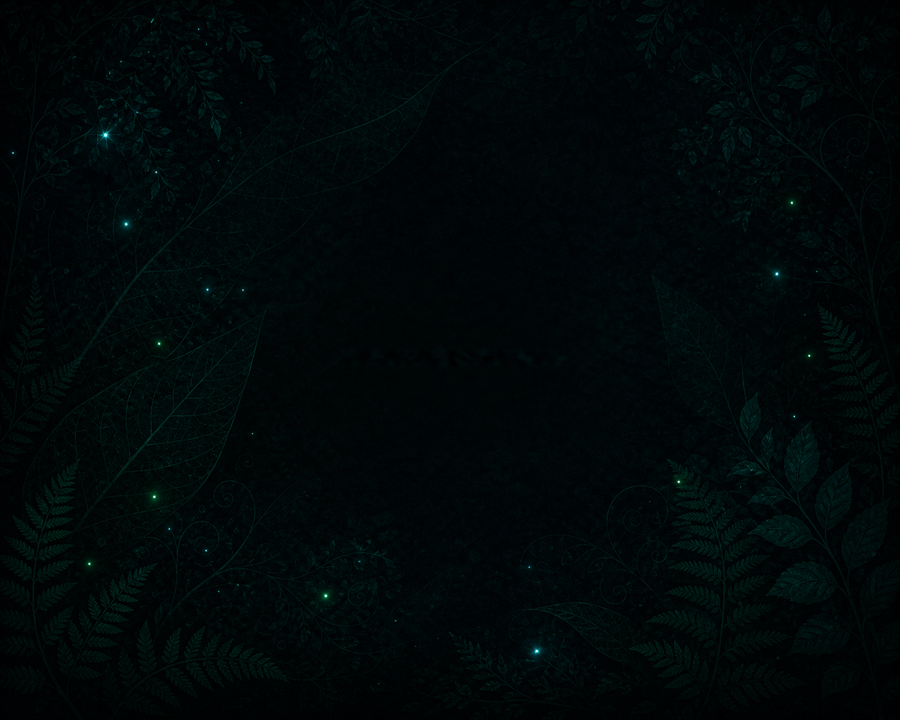

## Nymphs Sprite

Nymphs Sprite is a NymphsCore module for making game-ready sprite sets with a
clean, guided workflow:

```text
Character -> Pose Lab -> Style -> Generate -> Review -> Export
```

This repo replaces the old stale Nymphs Sprite codebase with the more evolved
Sprite Foundry module as a starting point. The goal is not to preserve every
experimental branch from Foundry. The goal is to distill the best ideas into a
slick, reliable sprite factory for NymphsCore.

<p align="center">
  
</p>

## What It Does

Nymphs Sprite generates directional sprite attempts through the local Nymphs
Image / Z-Image backend, keeps review state for each direction, and exports
accepted results as structured game assets.

The first working target is a dependable 8-direction flow, with 16 directions
available for experiments when the extra coverage is worth the extra runtime:

- Define a character prompt, subject id, sprite size, seed, LoRA, and style.
- Generate one attempt per direction with the Nymphs Image backend.
- Review results by direction.
- Regenerate weak directions without throwing away the whole set.
- Export accepted sprites from this module's own output folders.

Pose Lab creates deterministic OpenPose refs locally, with each direction saved
as its own editable pose slot. Generate now saves the current Pose Lab JSON set,
renders temporary OpenPose control images in memory, and sends those refs into
Z-Image `controlnet_edit` per direction.

## Module Boundaries

Nymphs Sprite uses Nymphs Image as a backend, but owns its outputs.

Default paths:

```text
$HOME/Nymphs-Sprite
$HOME/NymphsData/outputs/nymphs-sprite
$HOME/NymphsData/config/nymphs-sprite
$HOME/NymphsData/logs/nymphs-sprite
$HOME/NymphsData/cache/huggingface
$HOME/LoRA/loras
```

That means your existing Hugging Face model cache and LoRA downloads are shared
with Nymphs Image, while generated sprite runs stay under
`NymphsData/outputs/nymphs-sprite`.

## Current Backend

The current primary generation path is:

```text
Nymphs Sprite UI
  -> local module server
  -> Nymphs Image / Z-Image API
  -> Z-Image Turbo / Nunchaku
  -> optional Z-Image pixel-art LoRA
  -> Nymphs Sprite run output
```

ControlNet support is wired through the Z-Image `controlnet_edit` path. Pose
Lab sets are stored as editable JSON; PNG control maps are rendered only as
temporary generation handoff data, not as persistent guide libraries.

## Distilled UI Flow

### Character

Choose or write the character prompt, subject id, and negative prompt.

### Pose Lab

Choose ref strength and 8 or 16 directions. Pose Lab owns all ControlNet prep
flows:

- OpenPose Skeleton: local editable rig; implemented first.
- Canny / Line: future outline/silhouette lane.
- Scribble: future rough body-mass lane.
- Depth Mass: future grayscale volume lane.

OpenPose is the first-class path. Opening Pose Lab hot-swaps the main preview
area into a large rig editor and turns the normal preview strip into a live set
of 8 or 16 direction slots. Click a slot to edit it in the main canvas. Use the
checkbox on a slot to include or exclude it from the committed ref set. The
current direction keeps its own pose, so front, left, back, and 16-way
in-between slots can be tuned independently. Move Points is the default mode
and moves only the joint you drag. Keep Lengths is an optional IK helper for
wrists and ankles. Reset, mirror, and copy-all keep the panel fast.

The editable pose set is stored as JSON. The strip thumbnails are rendered live
from that JSON in the browser. ControlNet PNG maps should be generated from the
JSON only when needed for a generation handoff; they are temporary artifacts,
not the source of truth.

Committed refs stay under:

```text
$HOME/NymphsData/outputs/nymphs-sprite/pose_lab/refs/
```

Each commit writes one `pose_set.json` containing the full editable direction
set and the selected direction list. Clicking a committed pose set reloads that
saved set into Pose Lab for more editing. Optional contact sheets can be
exported for inspection, but stored pose libraries should stay JSON-first.

### Style

Pick the model, LoRA, trigger, scale, dimensions, steps, and seed.

### Generate

Create a full directional run. The default target is 8 directions:

```text
front
front_left
left
back_left
back
back_right
right
front_right
```

16-direction generation is available from the Guide direction selector, but 8
directions should remain the default test path until quality is dependable.

### Review

Inspect attempts, accept strong directions, reject weak directions, and
regenerate only what needs another pass.

The gallery should stay scoped to the newest run or guide folder after
generation. `Recent` is useful as a fallback, but it gets noisy fast.

### Export

Package the accepted set for downstream game engines. Godot-friendly packaging,
depth maps, and normal maps are planned as part of the production export path.

### Maps

Nymphs Sprite has a ComfyUI-free, model-backed map stage:

```bash
python -m foundry.cli derive-maps --subject goblin_scout --direction-count 8 --source cutout --backend depth_anything --sprite-size 96
```

The default backend is `depth_anything`, using Transformers depth estimation
directly in Python. `--backend midas` is also available. Both paths generate
depth from the pre-pixel cutout, then derive a normal map from that depth.
`--backend alpha_volume` exists only as an emergency/debug fallback.

The preferred source is `cutout`: the generated image after background removal
and square normalization, but before final sprite pixelation. That mirrors the
old Foundry idea: derive maps from the highest-detail accepted image, then
resize/pixelate albedo/depth/normal together so they stay aligned.

The model weights use the shared Nymphs Hugging Face cache:

```text
$HOME/NymphsData/cache/huggingface
```

Fetch the map weights from the module Details page with `Nymphs Sprite Map
Models`, or fetch them directly:

```bash
scripts/sprite_foundry_fetch_controlnet.sh --model nymphs_sprite_map_all
```

Individual fetch profiles are also available:

```text
nymphs_sprite_map_depth_anything
nymphs_sprite_map_midas
```

Outputs are written under the subject folder:

```text
$HOME/NymphsData/outputs/nymphs-sprite/<subject>/maps/<timestamp>/
├── albedo/
├── depth/
├── normal/
├── map_review.png
└── manifest.json
```

Later this same map lane can add PATINA, BRIA-cutout inputs, or a shared Nymphs
Texture / Map Lab backend.

## What We Kept From Sprite Foundry

Sprite Foundry had a lot of useful machinery mixed with a lot of experimental
surface area. The pieces worth carrying forward are:

- Directional run organization.
- Per-direction review and rejection.
- Regeneration/audition loops.
- Export manifests and deterministic asset folders.
- Future depth/normal/Godot verification ideas.
- The dark Nymphs-style UI shell, tightened into a simpler flow.

The pieces to demote or hide are:

- Too many generation modes on the first screen.
- Legacy ComfyUI-first assumptions.
- Confusing lifecycle buttons before a user has generated anything.
- Experimental flows that are useful as reference but not part of the everyday
  path.

## Install

Install through the NymphsCore Manager dev registry once this module is visible
as `Nymphs Sprite`.

For local development:

```bash
git clone https://github.com/nymphnerds/nymphs-sprite.git
cd nymphs-sprite
bash -n scripts/*.sh
python3 -m py_compile pipeline/foundry_gen_nymphscore.py scripts/sprite_foundry_ui_server.py
```

The module manifest starts the UI on port `8098`.

## First Test Pass

After install, test from top to bottom:

1. Confirm Manager shows `Nymphs Sprite`, not `Sprite Foundry`.
2. Open the UI and confirm the sidebar reads `Character -> Pose Lab -> Style -> Generate -> Review`.
3. Confirm status reports the shared Hugging Face cache and local LoRAs.
4. Generate a tiny 8-direction run at conservative settings.
5. Confirm outputs land under `NymphsData/outputs/nymphs-sprite`.
6. Confirm logs say `mode=controlnet` for the generated directions.
7. Confirm `recipe.json` lists non-empty `controlnet_directions`.
8. Review one direction and try a reject/regenerate loop.
9. Export only after accepted images exist.

## Roadmap

Near-term:

- Tune Pose Lab default proportions and ControlNet strength from real outputs.
- Add a compact audition strip inspired by Nymphs Image.
- Make review/regenerate the main workflow instead of an advanced lifecycle
  panel.

Next:

- Expand Pose Lab beyond OpenPose into sketch/body guide editing.
- Promote proven guide refs into a tiny curated preset set.
- Godot-ready export packaging.
- Normal and depth post-process outputs.
- Stronger sprite manifest contract for game projects.

The living design note is in
[docs/NYMPHS_SPRITE_DISTILLATION_PLAN.md](docs/NYMPHS_SPRITE_DISTILLATION_PLAN.md).

## License

[MIT](LICENSE)

Nymphs Sprite builds from the original Sprite Foundry foundation by MCP Tool
Shop, released under MIT.
